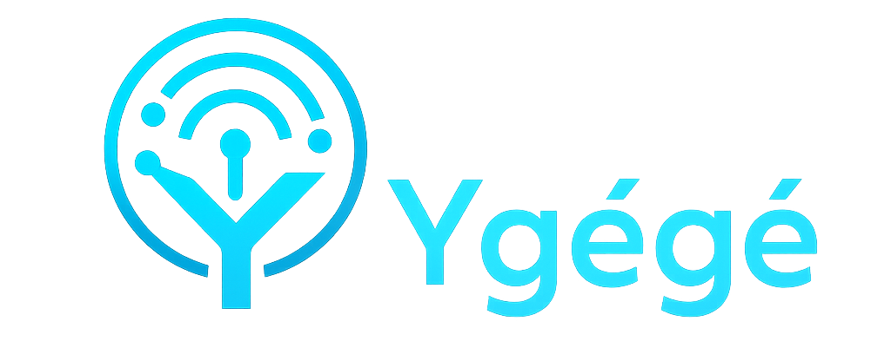

<p align="center">
  
</p>

<div align="right">
  <details>
    <summary>🌐 Language</summary>
    <div>
      <div align="center">
        <a href="README.md">Français</a>
        | <a href="README-en.md">English</a>
      </div>
    </div>
  </details>
</div>

# Ygégé - Édition FlareSolverr

Indexeur haute performance pour YGG Torrent écrit en Rust.  
**Cette version modifiée (fork) intègre le support de FlareSolverr pour contourner les protections Cloudflare strictes de l'indexeur.**

---

## 🚀 Installation avec Docker (Recommandée & Testée)

L'utilisation via Docker Compose est la méthode la plus fiable. Pour que l'intégration fonctionne sans erreurs de permissions (erreur 500 / timeout), **Ygégé et FlareSolverr doivent partager le même dossier de téléchargement via un volume Docker géré**.

Créez un fichier `docker-compose.yml` avec le contenu suivant :

```yaml
services:
  ygege:
    build: https://github.com/Gismo6303/ygege-flaresolverr.git
    container_name: ygege
    restart: unless-stopped
    # user: "1000:1000" # Si vous changez l'utilisateur ici...
    ports:
      - "8715:8715"
    environment:
      - YGG_USERNAME=votre_pseudo
      - YGG_PASSWORD=votre_mot_de_passe
      - FLARESOLVERR_URL=http://flaresolverr:8191
      - FLARESOLVERR_DOWNLOADS_DIR=/downloads
    volumes:
      - ./sessions:/app/sessions
      # Le pont crucial entre Ygégé et FlareSolverr
      - flaresolverr-bridge:/downloads 

  flaresolverr:
    image: ghcr.io/flaresolverr/flaresolverr:latest
    container_name: flaresolverr
    restart: unless-stopped
    # user: "1000:1000" # ...assurez-vous de mettre le même ici !
    environment:
      - LOG_LEVEL=info
    ports:
      - "8191:8191"
    volumes:
      # FlareSolverr télécharge les torrents ici, Ygégé les récupère de l'autre côté
      - flaresolverr-bridge:/app/Downloads

volumes:
  # Volume géré par Docker (évite les problèmes de permissions Linux)
  flaresolverr-bridge:
```

Lancez ensuite l'ensemble avec :
```bash
docker compose up -d
```

---

## 💻 Installation manuelle (Windows / Linux sans Docker)

Si vous lancez l'exécutable directement sur votre machine, vous devez ajouter ces paramètres dans votre fichier `conf.yml` (ou `config.json`) :

```json
{
  "flaresolverr_url": "[http://127.0.0.1:8191/](http://127.0.0.1:8191/)",
  "flaresolverr_downloads_dir": "/chemin/absolu/vers/votre/dossier/de/telechargement"
}
```

**Note :** Si le dossier n'est pas renseigné, le programme tentera par défaut d'utiliser le dossier standard sous Windows : `%USERPROFILE%\Downloads`. Testé avec FlareSolverr et Chrome, cela fonctionne parfaitement.

---

## https://discord.gg/rcsgdzNrvJ

## [DISCLAIMER LÉGAL](DISCLAIMER-fr.md)

**Caractéristiques principales** :
- Résolution automatique du domaine actuel de YGG Torrent
- **Bypass Cloudflare automatisé** via FlareSolverr
- Recherche quasi instantanée
- Reconnexion transparente aux sessions expirées
- Caching des sessions
- Contournement des DNS menteurs
- Consommation mémoire faible (14.7Mo en mode release sur Linux)
- Recherche de torrents très modulaire (par nom, seed, leech, commentaires, date de publication, etc.)
- Récupération des informations complémentaires sur les torrents (description, taille, nombre de seeders, leechers, etc.)
- Pas de dépendances externes (hors FlareSolverr pour Cloudflare)
- Pas de drivers de navigateur requis

## Prérequis pour la compilation
- Rust 1.85.0+
- OpenSSL 3+
- Toutes les dépendances requises pour la compilation de [wreq](https://crates.io/crates/wreq)

# Installation

Une image Docker prête à l'emploi est disponible pour Ygégé.
Pour commencer le déploiement et la configuration de Docker, consultez le [Guide dédié à Docker](https://ygege.lila.ws/installation/docker-guide).

> [!IMPORTANT]
> Si vous rencontrez une erreur `Permission denied` après mise à jour, consultez la section [Gestion des permissions](https://ygege.lila.ws/installation/docker-guide#gestion-des-permissions) du guide Docker.

## Docker

Pour créer une image Docker personnalisée avec vos propres optimisations, consultez le [Guide de création Docker](https://ygege.lila.ws/installation/docker-guide).

## Installation manuelle

Pour compiler l'application à partir des sources, suivez le [Guide d'installation manuel](https://ygege.lila.ws/installation/source-guide).

Pour les fans de Docker, n'hésitez pas à contribuer au projet en m'aidant à créer une image Docker.

## Configuration IMDB et TMDB

Pour activer la récupération des métadonnées IMDB et TMDB, veuillez suivre les instructions du [guide d'assistance TMDB et IMDB](https://ygege.lila.ws/tmdb-imdb).

## Intégration à Prowlarr

Ygégé peut être utilisé comme indexeur personnalisé pour Prowlarr. Pour le mettre en place, trouvez votre répertoire AppData (situé dans la page `/system/status` de Prowlarr) et copiez le fichier `ygege.yml` du repo dans le dossier `{votre chemin appdata prowlarr}/Definitions/Custom`, vous aurez probablement besoin de créer le dossier `Custom`.

Une fois que c'est fait, redémarrez Prowlarr et allez dans les paramètres des indexeurs, vous devriez voir Ygégé dans la liste des indexeurs disponibles.

> [!NOTE]
> Prowlarr ne permet pas de personnaliser le "Base URL". Par défaut, utilisez `http://localhost:8715/`. Pour les configurations Docker Compose, utilisez `http://ygege:8715/`. Alternativement, utilisez ygege-dns-redirect.local avec un DNS personnalisé ou en éditant le fichier hosts.

## Intégration à Jackett

Ygégé peut être utilisé comme indexeur personnalisé pour Jackett. Pour le mettre en place, localisez votre répertoire AppData Jackett et copiez le fichier `ygege.yml` du dépôt dans le dossier `{votre chemin appdata jackett}/cardigann/definitions/`. Vous devrez peut-être créer le sous-dossier `cardigann/definitions/` s'il n'existe pas.

> [!NOTE]
> L'image Docker LinuxServer Jackett fournit une structure de dossiers bien organisée. Si vous utilisez une autre image Docker, adaptez les chemins en conséquence.

Une fois terminé, redémarrez Jackett et accédez aux paramètres des indexeurs. Vous devriez voir Ygégé dans la liste des indexeurs disponibles.

## Contournement Cloudflare
Pour contourner le défi de Cloudflare, Ygégé n'utilise pas de navigateur ni de services tiers (en dehors de FlareSolverr pour les requêtes complexes).

Une règle Cloudflare est appliquée sur le site YGG Torrent pour empêcher l'apparition du challenge Cloudflare via le cookie `account_created=true` censé garantir que l'utilisateur a un compte valide et est connecté.

Mais ce n'est pas si simple, Cloudflare vous surveille toujours et détecte les faux clients HTTPS et les faux navigateurs.

Pour contourner cela, Ygégé utilise la librairie [wreq](https://crates.io/crates/wreq) qui est un client HTTP basé sur `reqwest` et `tokio` permettant de reproduire 1:1 l'échange TLS et HTTP/2 avec le serveur afin de simuler un vrai navigateur.

J'ai aussi remarqué que cela ne passait plus à partir de Chrome 133, sûrement à cause de l'intégration de HTTP/3 dans Chrome qui n'est pas encore simulée par `wreq`.

Je recommande aux curieux [cet article](https://fingerprint.com/blog/what-is-tls-fingerprinting-transport-layer-security/) qui explique comment fonctionne le fingerprinting TLS et [cet autre article](https://www.trickster.dev/post/understanding-http2-fingerprinting/) qui explique comment fonctionne le fingerprinting HTTP/2 et comment il est possible de le contourner.

## Test de performance

Query pour la recherche : `Vaiana 2` | Tri : `seeders` | Ordre : `descendant`

| Mesure | Nombre de tests | Temps total | Temps moyen |
|--------|-----------------|-------------|-------------|
| Résolution du domaine actuel de YGG | 25 | 3220,378ms | 128,815ms |
| Nouvelle connexion YGG | 10 | 4881,713ms | 488,171ms |
| Restauration de session YGG | 10 | 2064,672ms | 206,467ms |
| Recherche | 100 | 17621,045ms | 176,210ms |

# Documentation

## Documentation utilisateur

La documentation complète est disponible sur [ygege.lila.ws](https://ygege.lila.ws) :
- [Guide de démarrage](https://ygege.lila.ws/getting-started)
- [Installation](https://ygege.lila.ws/installation/docker-guide)
- [Configuration](https://ygege.lila.ws/configuration)
- [Intégrations (Prowlarr/Jackett)](https://ygege.lila.ws/integrations/prowlarr)
- [Documentation de l'API](https://ygege.lila.ws/api)
- [FAQ](https://ygege.lila.ws/faq)

## Documentation développeur

Pour contribuer au projet ou comprendre le fonctionnement interne :
- [Guide de contribution](docs/contribution-fr.md)
- [Pipeline CI/CD](docs/ci_implementation-fr.md)
- [Workflow de preview des PRs](docs/preview_workflow-fr.md)
- [Workflow de release](docs/release_workflow-fr.md)
